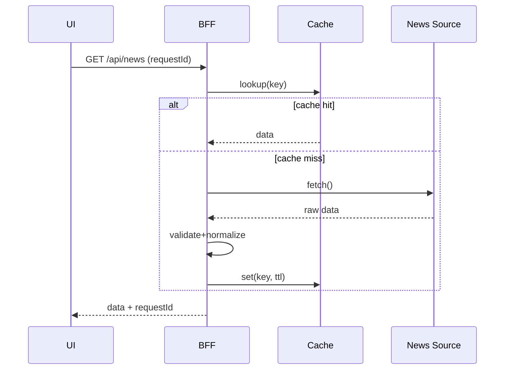
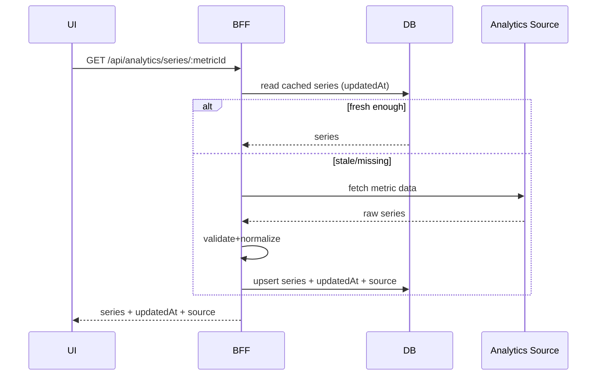
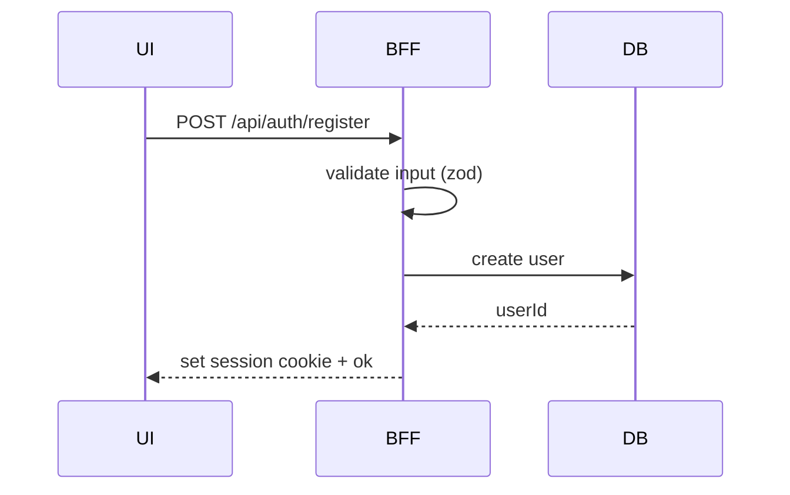

Narraive / AiNews — Architecture (v0)

---

## 2–3 minute pitch (короткое объяснение)

- **Что это**: продукт про AI/news + аналитика + аккаунт (и позже — монетизация + AI pipeline).
- **Как устроено**: Next.js приложение (UI) + BFF (API routes) как единая точка интеграции с внешними источниками/БД/AI/PAY.
- **Почему так**: модульный монолит быстрее в разработке и проще в эксплуатации на старте; выделение Python/фоновых задач — только когда появляется реальная нагрузка.

---

## Modules (границы ответственности)

- **News**
  - агрегация новостей из источников (HN/RSS/…)
  - нормализация/обогащение (теги/summary — позже через AI)
  - поиск/фильтры/детальная
- **Analytics**
  - time-series метрики + инсайты
  - источники метрик + обновление/кэш
- **Account**
  - регистрация/логин, sessions
  - профиль/настройки
  - bookmarks/read later
- **Billing (MVP-2)**
  - подписка/планы
  - webhooks + идемпотентность
  - доступ по ролям/плану
- **AI Pipeline (v1)**
  - raw → processed (summary/tags)
  - статусы, ретраи, идемпотентность

---

## Boundaries & rules (v0)

**Boundary слои**

- **UI (React pages/components)**: только отображение + вызовы BFF, без ключей и внешних интеграций.
- **BFF (Next API routes / server actions)**: единственная точка доступа к внешним API/БД/AI/платежам.
- **External APIs**: всегда “untrusted input” → validate → normalize.
- **DB**: хранит доменные сущности и статусы пайплайна.
- **Python processor**: отдельная ответственность (обработка текста), общение по контракту.

**Запреты**

- Нельзя вызывать внешние News/Analytics API с клиента напрямую.
- Нельзя пропускать невалидные данные: на входе всегда validation (zod / pydantic).
- Нельзя логировать PII/секреты; в логах и Sentry — минимум данных.

---

## C4 L1 — System Context (квадраты-стрелки)

```mermaid
flowchart LR
  U((User)) -->|Browser| UI[Next.js UI]
  UI -->|HTTP| BFF[Next.js BFF\n(API routes/server)]

  BFF --> NEWS[(News Sources\nHN Algolia, RSS)]
  BFF --> AN[(Analytics Sources\nWikimedia, arXiv)]
  BFF --> DB[(DB\nSQLite -> Postgres)]
  BFF --> PY[Python AI Processor]
  BFF --> PAY[(Payments\nStripe)]

  UI --> S[(Sentry)]
  BFF --> S
```

---

## Data flows (v0)

### 1) News list (fetch → cache → UI)



### 2) Analytics series (metrics → storage → charts)



### 3) Auth/session (register/login)



---

## Non-goals (v0)

- Микросервисы “ради микросервисов”
- Сложный event-driven дизайн без необходимости
- “Идеальная” платформа наблюдаемости на старте

---

## Related docs

- `API_CONTRACT.md`
- `DATA_SOURCES.md`
- `OBSERVABILITY.md`
- `DB_MIGRATION.md`
- `SYSTEM_DESIGN_DRILLS.md`

